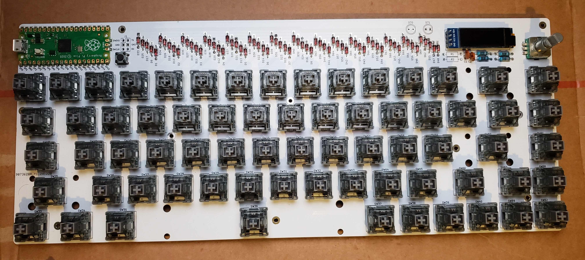
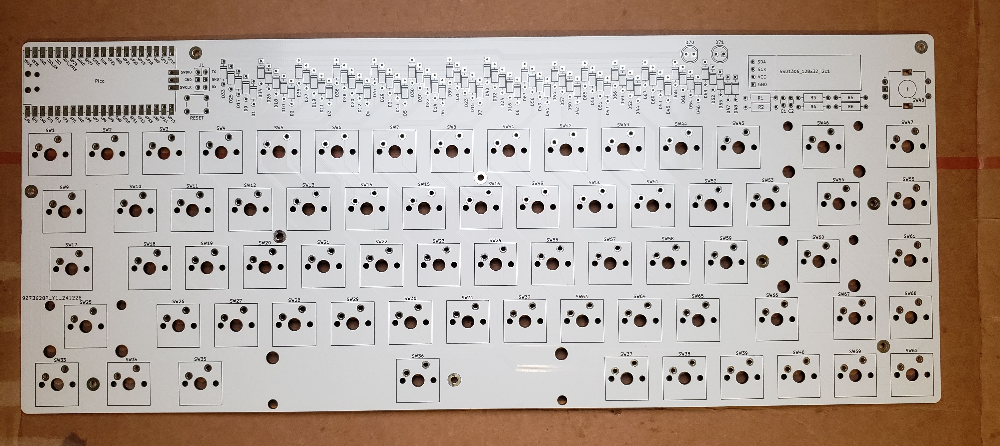
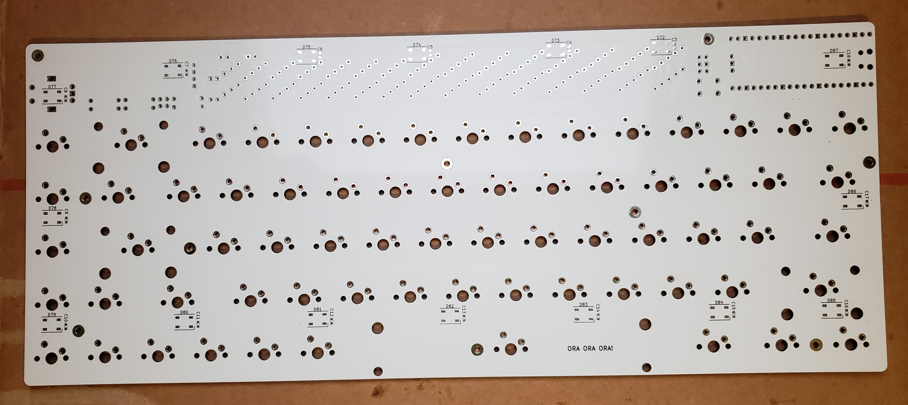

# Anesidora

A 65% keyboard PCB for the Raspberry pi pico made with KiCad 8, and a custom firmware.





## Assembly

### THT components
- Raspberry Pico
- Keyboard Switches (x68)
- Keyboard Stabilizers
- Rotary Encoder
- Resistors 10KOhm (x4)
- Capacitors 0.1µF (x2)
- Diodes 1N4148 (x69)
- SSD1306 OLED display 128x32
- LEDs (x2)
- Resistors (x2 for LEDs)
- Button
- 2.54mm Male Pin Header 2x6

### SMD components
- leds WS2812B (x16)
- SMD Capacitors 0603 100nF (x16)

## 📦 Build the firmware
1.
Install the pico C/C++ SDK (https://www.raspberrypi.com/documentation/microcontrollers/c_sdk.html)

2.
```sh
export ANESIDORA_PATH=path/to/Anesidora
```

3.
```sh
export PICO_USB_DISK_PATH=path/to/RPI-RP2
```

4.
```sh
./deploy.sh --build --flash
```
